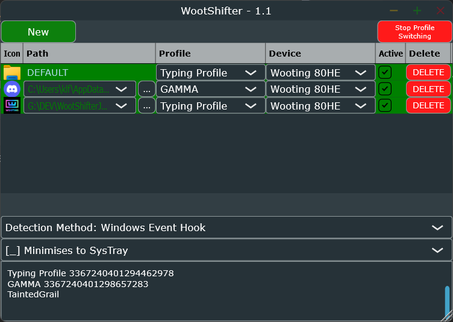
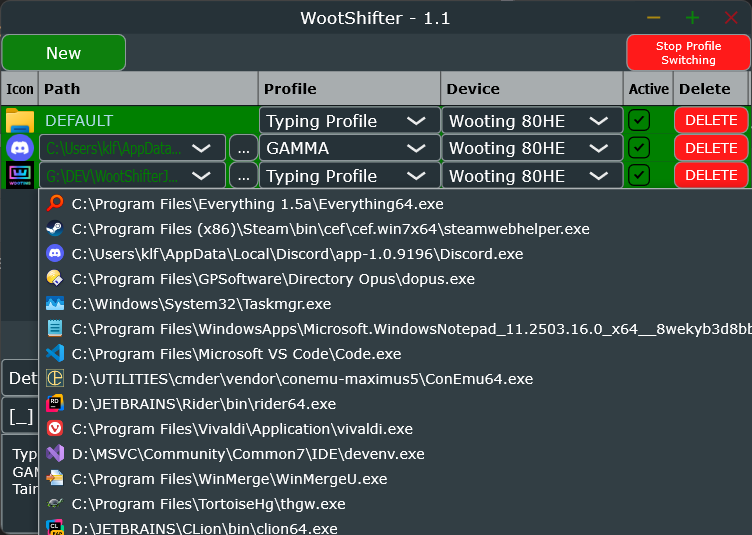

An automatic Wooting Keyboard Profile Switcher for Windows. 

Detects when focussed application changes and switches keyboard profile accordingly. Pulls data from the keyboard and the Wootility local database (Wootility can't be running when WootShifter starts!). Automatically lists running Apps for easy selection.

